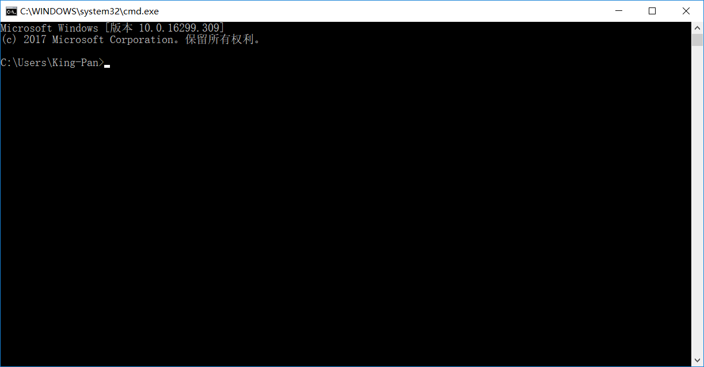
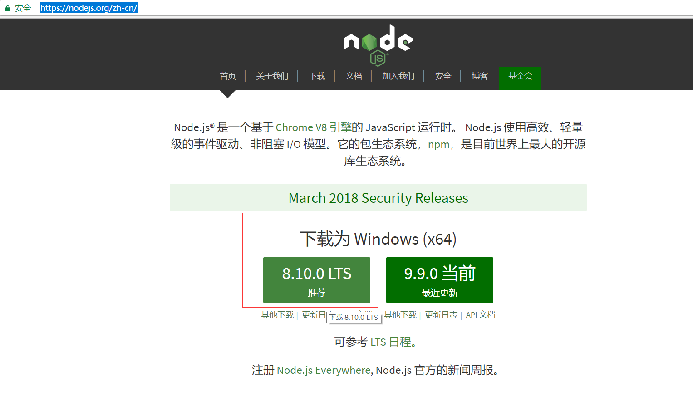
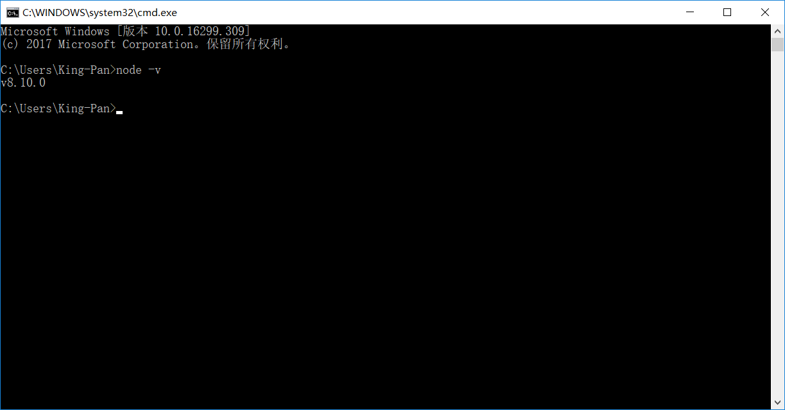
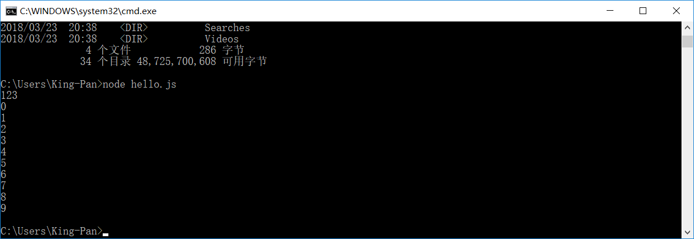

# 1、node简介

## 1.1、node简介

- Node主要用于编写像Web服务器一样的网络应用，这和PHP

和Python是类似的。

- 但是Node与其他语言最大的不同之处在于，PHP等语言是阻

塞的而Node是非阻塞的。

- Node是事件驱动的。开发者可以在不使用线程的情况下开发

出一个能够承载高并发的服务器。其他服务器端语言难以开发
高并发应用，而且即使开发出来，性能也不尽人意。

- Node正是在这个前提下被创造出来。

  ​

-  Node把JS的易学易用和Unix网络编程的强大结合到了一起。

Node
	- Node是对ES标准一个实现，Node也是一个JS引擎
	- 通过Node可以使js代码在服务器端执行
	- Node仅仅对ES标准进行了实现，所以在Node中不包含DOM 和 BOM	
	- Node中可以使用所有的内建对象
		String Number Boolean Math Date RegExp Function Object Array
		而BOM和DOM都不能使用
			但是可以使用 console 也可以使用定时器（setTimeout() setInterval()）
			

## 1.2、node特点

* 1.非阻塞、异步的I/O
* 2.事件和回调函数
* 3.单线程（主线程单线程，后台I/O线程池）
* 4.跨平台

> Node.js是一个能够在服务器端运行JavaScript的开放源代码、跨平台==JavaScript运行环境==。

> Node采用Google开发的V8引擎运行js代码，使用==事件驱动、非阻塞和异步I/O模型==等技术来提高性能，可优化应用程序的传输量和规模。

> Node大部分基本模块都用JavaScript编写。在Node出现之前，JS通常作为客户端程序设计语言使用，以JS写出的程序常在用户的浏览器上运行。

> 目前，Node已被IBM、Microsoft、Yahoo!、Walmart、Groupon、SAP、 LinkedIn、Rakuten、PayPal、Voxer和GoDaddy等企业采用。

## 1.3、瑞安*达尔(Ryan Dahl)

Ryan Dahl并非科班出身的开发者，在2004年的时候他还在纽
约的罗彻斯特大学数学系读博士。
• 2006年，也许是厌倦了读博的无聊，他产生了『世界那么大，
我想去看看』的念头，做出了退学的决定，然后一个人来到智
利的Valparaiso小镇。
• 从那起，Ryan Dahl不知道是否因为生活的关系，他开始学习
网站开发了，走上了码农的道路。
• 那时候Ruby on Rails很火，他也不例外的学习了它。

从那时候开始，Ryan Dahl的生活方式就是接项目，然后去客
户的地方工作，在他眼中，拿工资和上班其实就是去那里旅行。
• Ryan Dahl经过两年的工作后，成为了高性能Web服务器
的专家，从接开发应用到变成专门帮客户解决性能问题的
专家。

期间他开始写一些开源项目帮助客户解决Web服务器的高
并发性能问题，他尝试了很多种语言，但是最终都失败了。
• 在他快绝望的时候，V8引擎来了。V8满足他关于高性能
Web服务器的想象。于是在2009年2月它开始着手编写
Node.js


## 1.4、node历史

| 时间       | 事件                                                      |
| ---------- | --------------------------------------------------------- |
| 2009年     | 瑞安·达尔（Ryan Dahl）在GitHub上发布node的最初版本        |
| 2010年1月  | Node的包管理器npm诞生                                     |
| 2010年底   | Joyent公司赞助Node的开发，瑞安·达尔加入旗下，全职负责Node |
| 2011年7月  | Node在微软的帮助下发布了windows版本                       |
| 2011年11月 | Node超越Ruby on Rails，称为GitHub上关注度最高的项目       |
| 2012年1月  | 瑞安·达尔离开Node项目                                     |
| 2014年12月 | Fedor Indutny在2014年12月制作了分支版本，并起名“io.js”    |
| 2015年初   | Node.js基金会成立（IBM、Intel、微软、Joyent）             |
| 2015年9月  | Node.js和io.js合并，Node 4.0发布                          |
| 2016年     | Node 6.0发布                                              |
| 2017年     | Node 8.0发布                                              |

## 1.5、Node的用途

> Web服务API,比如REST

> 实时多人游戏

> 后端的Web服务,例如跨域、服务器端的请求

> 基于Web的应用

> 多客户端的通信，如即时通信

# 2、Node环境搭建

## 2.1、window常用命令

> win+r打开运行窗口:


> cmd打开命令行终端



> 常用命令

* dir 列出当前目录下的所有文件
* cd 目录名 进入到指定的目录
* md 目录名 创建一个文件夹
* rd 目录名 删除一个文件夹	

- ==目录==
  ==. 表示当前目录==
  ==.. 表示上一级目录==

​		

	- 环境变量（windows系统中变量）	
		path
			C:\work\jdk\jdk1.7.0_75/bin;
			%CATALINA_HOME%/bin;
			C:\work\soft\tools\AppServ\Apache24\bin;
			C:\work\soft\tools\AppServ\php5;
			C:\Users\lilichao\AppData\Local\Programs\Fiddler;
			C:\work\environment\Egret\Egret Wing 3\bin;
			C:\Users\lilichao\AppData\Roaming\npm;
			C:\Program Files\MongoDB\Server\3.2\bin;
			C:\Users\lilichao\Desktop\hello
			
		- 当我们在命令行窗口打开一个文件，或调用一个程序时，
			系统会首先在当前目录下寻找文件程序，如果找到了则直接打开
			如果没有找到则会依次到环境变量path的路径中寻找，直到找到为止
			如果没找到则报错
			
	
		- 所以我们可以将一些经常需要访问的程序和文件的路径添加到path中，
			这样我们就可以在任意位置来访问这些文件和程序了

I/O (Input/Output)
	- I/O操作指的是对磁盘的读写操作

##2.2、Node安装配置	

> 下载node.js

[node下载地址](https://nodejs.org/zh-cn/)



下载后傻瓜式安装，找到安装位置，然后配置环境变量

我的电脑-->属性-->高级系统设置-->环境变量


测试node命令



至此，node.js环境搭建完成。下一节进入node.js的学习


hello.js

```js
console.log(123);
for(var i=0;i<10;i++){
	console.log(i);
}
```


```powershell
C:\Users\King-Pan>node hello.js
```



==05章节==

进程 

- 进程负责为程序的运行提供必备的环境
- 进程就相当于工厂中的车间

线程

* 线程是计算机中的最小计算单位，线程负责执行进程中的程序
* 线程就相当于工厂中的工人

