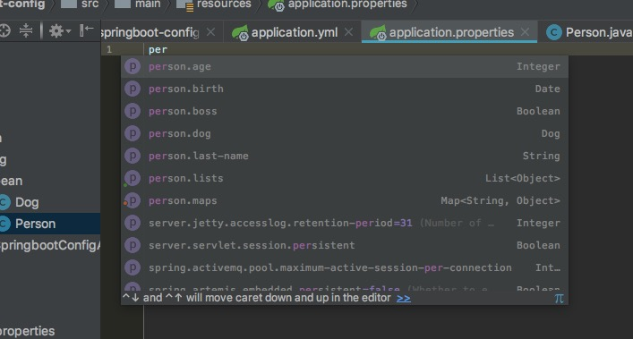
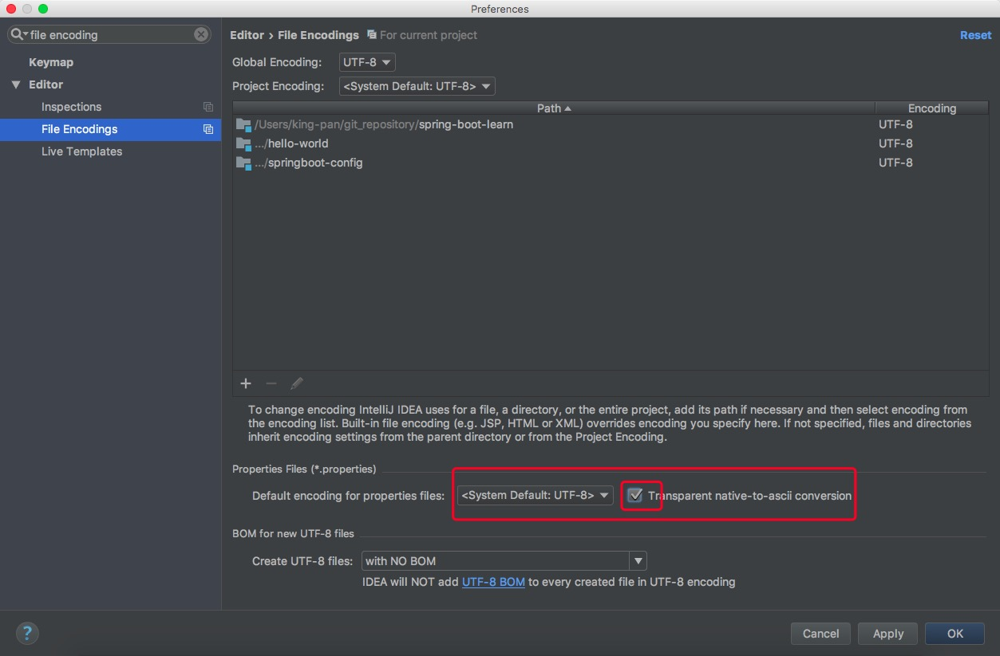

#二、配置文件

## 1、配置文件

Spring Boot使用一个全局的配置文件，配置文件名是固定的

* application.properties(优先级高)
* application.yml

配置文件的作用:修改Spring Boot自动配置的默认值;

YAML(YAML Ain't Markup Language)

* YAML A Markup Language: YAML是一个标记语言
* YAML isn't Markup Language: YAML不是一个标记语言

标记语言:

s以前的配置文件：大多数都使用的是xxx.xml文件

YAML:==是以数据为中心==，比json、xml等更适合做配置文件

YAML:配置例子

```yaml
server:
  port: 8081
```

XML:

```XML
<server>
	<port>8081</port>
</server>
```

## 2、YAML语法

### 1、基本语言

k: v    表示一对键值对(k/v之前必须有空格)

以空格的缩进来控制层级关系；只要是左对齐的一列数据都是同一层级的

```yaml
server:
	port: 8081
	path: /hello
```

属性和值也是大小写敏感的；

### 2、值的写法

#### 2.1、字面量: 普通的值(数字，字符串，布尔)

k: v   字面量直接写

​    字符串默认不用加上单引号和双引号

​    "":双引号不会转义字符串里面的特殊字符；特殊字符会作为本身想表达的意思

```yaml
name: "张三\n李四"
```

> 日期格式: 支持yyyy/mm/dd

​        name: "张三\n李四"    输出:  张三换行李四

   '':单引号会转义特殊字符，特殊字符最终只是y一个普通的字符串数据

```yaml
name: '张三\n李四' 
```


  	name: '张三\n李四'     输出: 张三\n李四

####2.2、对象、Map(属性和值/键值对):

> k: v  对象还是键值对的形式,在下一行写属性和值的关系;注意缩进

```yaml
firends:

	lastName: 张三

	age: 20
```

> 行内写法:

```yaml
firends: {lastName:张三,age:20}
```

#### 2.3、 数组(List、Set):

> 用"- 值"的格式表示数组中的一个元素

```yaml
pets:
 - cat
 - dog
 - pig
```

> 行内写法:

```yaml
pets:[cat,dog,pig]
```


### 3、配置文件值注入

#### 3.1、yml配置

> 配置文件

```yaml
person:
    lastName: 张三
    age: 19
    boss: false
    birth: 2017/12/18
    maps: {k1: v1,k2: v2,k3: v3}
    lists:
      - lisi
      - wangwu
    dog:
      name: 旺财
      age: 3
```

> 配置类

```java
package club.javalearn.config.bean;

import org.springframework.boot.context.properties.ConfigurationProperties;
import org.springframework.stereotype.Component;

import java.util.Date;
import java.util.List;
import java.util.Map;

/**
 * 将配置文件中配置的每一个属性的值，映射到这个组件中
 * @ConfigurationProperties: 告诉Spring Boot将本类中的所有属性和配置文件中相关的配置进行绑定
 * prefix = "person"配置文件中哪个下面的所有属性进行一一映射
 * 只有这个组件是容器中的组件才能使用容器提供的功能
 * @author king-pan
 * @date 2018-03-22
 **/
@Component
@ConfigurationProperties(prefix = "person")
public class Person {
    private String lastName;
    private Integer age;
    private Boolean boss;
    private Date birth;

    private Map<String,Object> maps;
    private List<Object> lists;
    private Dog dog;

    public String getLastName() {
        return lastName;
    }

    public void setLastName(String lastName) {
        this.lastName = lastName;
    }

    public Integer getAge() {
        return age;
    }

    public void setAge(Integer age) {
        this.age = age;
    }

    public Boolean getBoss() {
        return boss;
    }

    public void setBoss(Boolean boss) {
        this.boss = boss;
    }

    public Date getBirth() {
        return birth;
    }

    public void setBirth(Date birth) {
        this.birth = birth;
    }

    public Map<String, Object> getMaps() {
        return maps;
    }

    public void setMaps(Map<String, Object> maps) {
        this.maps = maps;
    }

    public List<Object> getLists() {
        return lists;
    }

    public void setLists(List<Object> lists) {
        this.lists = lists;
    }

    public Dog getDog() {
        return dog;
    }

    public void setDog(Dog dog) {
        this.dog = dog;
    }

    @Override
    public String toString() {
        return "Person{" +
                "lastName='" + lastName + '\'' +
                ", age=" + age +
                ", boss=" + boss +
                ", birth=" + birth +
                ", maps=" + maps +
                ", lists=" + lists +
                ", dog=" + dog +
                '}';
    }
}
```

==@ConfigurationProperties: 告诉Spring Boot将本类中的所有属性和配置文件中相关的配置进行绑定==

==prefix = "person"配置文件中哪个下面的所有属性进行一一映射==

==只有这个组件是容器中的组件才能使用容器提供的功能==

spring-boot2.0以上版本不推荐

```java
package club.javalearn.config.bean;

/**
 * spring-boot-learn
 *
 * @author king-pan
 * @date 2018-03-22
 **/
public class Dog {
    private String name;

    private Integer age;

    public String getName() {
        return name;
    }

    public void setName(String name) {
        this.name = name;
    }

    public Integer getAge() {
        return age;
    }

    public void setAge(Integer age) {
        this.age = age;
    }

    @Override
    public String toString() {
        return "Dog{" +
                "name='" + name + '\'' +
                ", age=" + age +
                '}';
    }
}
```

我们可以导入配置文件处理器，导入以后可以提示

```xml
<!--配置文件处理器,配置文件进行绑定，就会有提示-->
<dependency>
    <groupId>org.springframework.boot</groupId>
    <artifactId>spring-boot-configuration-processor</artifactId>
    <optional>true</optional>
</dependency>
```


> 测试提示功能

把application.yml中person相关配置注释掉，然后再application.properties文件中配置person属性





> 在properties文件中中文可能出现乱码

```properties
person.last-name=张三
```

spring-boot-2.0版本中配置文件中不推荐使用驼峰写法，推荐使用-连接符连接

```shell
Person{lastName='张三', age=null, boss=null, birth=null, maps=null, lists=null, dog=null}
```


==idea中文件编码格式默认为UTF-8，而properties默认是ascii，所以需要设置idea==

==mac上，设置完file encoding后还是乱码==



> @Value注解: @Value("${person.last-name}")

使用@Value注解可以获取properties文件中的属性


#### 3.2、@Value注解和@ConfigurationProperties的区别

|                    | @ConfigurationProperties  | @Value       |
| ------------------ | ------------------------- | ------------ |
| 功能               | 批量注入配置文件属性      | 一个一个指定 |
| 松散绑定(松散语法) | 支持(lastName、last-name) | 不支持       |
| SpEL               | 不支持                    | 支持         |
| JSR303数据校验     | 支持                      | 不支持       |
| 复杂类型封装       | 支持                      | 不支持       |

==JSR303数据校验，需要在配置类上添加@Validated注解，在需要校验的字段上添加校验规则==

配置文件yml和properties它们都能获取值

如果在某个业务逻辑中获取多个值，那么就使用@ConfigurationProperties

如果在某个业务逻辑中获取单个值，那么就使用@Value

如果在某个业务逻辑中使用SpEL表达式，那么就使用@Value，其他场景都可以使用@ConfigurationProperties

如果我们专门编写了一个javabean和配置文件进行映射，我们j就直接使用@ConfigurationProperties

@ConfigurationProperties和@Value默认都是从全局默认配置文件中获取值

#### 3.3、配置文件注入值数据校验

> Java配置类

```java
@Component
@ConfigurationProperties(prefix = "person")
@Validated
public class Person {
    @Email
    private String lastName;
    private Integer age;
    private Boolean boss;
    private Date birth;

    private Map<String,Object> maps;
    private List<Object> lists;
    private Dog dog;
    //getter and setter
}
```

> yaml配置文件

```yaml
person:
    lastName: 张三
    age: 19
    boss: false
    birth: 2017/12/18
    maps: {k1: v1,k2: v2,k3: v3}
    lists:
      - lisi
      - wangwu
    dog:
      name: 旺财
      age: 3


```


> 控制台报错

```shell
Description:

Binding to target org.springframework.boot.context.properties.bind.BindException: Failed to bind properties under 'person' to club.javalearn.config.bean.Person failed:

    Property: person.lastName
    Value: 张三
    Origin: class path resource [application.yml]:2:15
    Reason: 不是一个合法的电子邮件地址


Action:

Update your application's configuration
```


#### 3.4、@PropertySource和@ImportResource

> @PropertySource: 加载指定的配置文件

```java
@PropertySource(value = {"classpath:person.properties"})
@Component
@ConfigurationProperties(prefix = "person")
public class Person {
    private String lastName;
    private Integer age;
    private Boolean boss;
    private Date birth;

    private Map<String,Object> maps;
    private List<Object> lists;
    private Dog dog;
    //getter and setter
}
```

person.properties配置文件(注意,默认配置文件中的相同配置可以覆盖person.properties文件中的内容)

```properties
person.last-name=mack
person.age=101
```

application.yml(需要全部注释)

```yaml
person:
#    lastName: 张三
#    age: 19
    boss: false
    birth: 2017/12/18
    maps: {k1: v1,k2: v2,k3: v3}
    lists:
      - lisi
      - wangwu
    dog:
      name: 旺财
      age: 3
```

测试代码

```java
package club.javalearn.config;

import club.javalearn.config.bean.Person;
import org.junit.Test;
import org.junit.runner.RunWith;
import org.springframework.beans.factory.annotation.Autowired;
import org.springframework.boot.test.context.SpringBootTest;
import org.springframework.test.context.junit4.SpringRunner;

/**
 * @author king-pan
 * Spring-Boot单元测试
 * 可以在测试期间很方便的测试,类似自动注入容器等。
 *
 */
@RunWith(SpringRunner.class)
@SpringBootTest
public class SpringbootConfigApplicationTests {

	@Autowired
	Person person;

	@Test
	public void contextLoads() {
		System.out.println(person);
		System.out.println(person.getLastName());
	}

}
```

测试结果

```java
Person{lastName='mack', age=101, boss=false, birth=Mon Dec 18 00:00:00 CST 2017, maps={k1=v1, k2=v2, k3=v3}, lists=[lisi, wangwu], dog=Dog{name='旺财', age=3}}
mack
```

> @ImportResource: 导入Spring的配置文件，让配置文件里面的内容生效;

 spring boot 里面没有Spring的配置文件，我们自己编写的配置文件，也不能自动识别

想让Spring的配置文件生效，加载进来；@ImportResource加载进来

启动类

```java
@SpringBootApplication
@ImportResource(locations = {"classpath:beans.xml"})
public class SpringbootConfigApplication {

	public static void main(String[] args) {
		SpringApplication.run(SpringbootConfigApplication.class, args);
	}
}
```

beans.xml文件

```xml
<?xml version="1.0" encoding="UTF-8"?>
<beans xmlns="http://www.springframework.org/schema/beans"
       xmlns:xsi="http://www.w3.org/2001/XMLSchema-instance"
       xsi:schemaLocation="http://www.springframework.org/schema/beans http://www.springframework.org/schema/beans/spring-beans.xsd">
    <bean class="club.javalearn.config.service.HelloService" id="helloService"></bean>
</beans>
```

HelloService类

```java
package club.javalearn.config.service;

/**
 * spring-boot-learn
 *
 * @author king-pan
 * @date 2018-03-22
 **/
public class HelloService {
}
```

测试代码

```java
package club.javalearn.config;

import club.javalearn.config.bean.Person;
import club.javalearn.config.service.HelloService;
import org.junit.Test;
import org.junit.runner.RunWith;
import org.springframework.beans.factory.annotation.Autowired;
import org.springframework.boot.test.context.SpringBootTest;
import org.springframework.context.ApplicationContext;
import org.springframework.test.context.junit4.SpringRunner;

/**
 * @author king-pan
 * Spring-Boot单元测试
 * 可以在测试期间很方便的测试,类似自动注入容器等。
 *
 */
@RunWith(SpringRunner.class)
@SpringBootTest
public class SpringbootConfigApplicationTests {

	@Autowired
	Person person;

	@Autowired
	ApplicationContext ac;


	@Test
	public void testHellService(){
		boolean exists = ac.containsBean("helloService");
		System.out.println(exists);
	}

	@Test
	public void contextLoads() {
		System.out.println(person);
		System.out.println(person.getLastName());
	}

}
```

Spring Boot推荐给容器中添加组件的方式,推荐全注解的方式

1、配置类等同于配置文件

```java
package club.javalearn.config;

import club.javalearn.config.service.HelloService;
import org.springframework.context.annotation.Bean;
import org.springframework.context.annotation.Configuration;

/**
 * spring-boot-learn
 * @Configuration指明当前类为配置类,就是来替换之前的Spring配置文件
 * 在配置文件中用<bean></bean>标签添加组件的，在配置类中
 * @author king-pan
 * @date 2018-03-22
 **/
@Configuration
public class MyApplicationConfig {

    //@Bean 将方法的返回值添加到容器中，容器中这个组件的默认ID就是这个方法名
    @Bean
    public HelloService helloService(){
        System.out.println("使用java注解配置");
        return new HelloService();
    }
}
```

```
@SpringBootApplication
//@ImportResource(locations = {"classpath:beans.xml"})
public class SpringbootConfigApplication {

	public static void main(String[] args) {
		SpringApplication.run(SpringbootConfigApplication.class, args);
	}
}
```

### 4、配置文件占位符

#### 4.1、随机数

```
${random.value}、${random.int}、${random.long}
${random.int(10)}、${random.int[1024,65536]}
```

#### 4.2、占位符获取之前配置的值，如果没有可以是用:指定默认值

```yml
person:
    lastName: 张三
    age: 19
    boss: false
    birth: 2017/12/18
    maps: {k1: v1,k2: v2,k3: v3}
    lists:
      - lisi
      - wangwu
    dog:
      name: 旺财
      age: 3
```

### 5、Profile

#### 5.1、多Profile文件

我们在主配置文件编写的时候，文件名可以是   application-{profile}.properties/yml

默认使用application.properties的配置；

#### 5.2、yml支持多文档块方式

yaml文件通过---来划分文档块，并且在每个文档块中定义spring.profiles.active值

```yaml
server:
  port: 8081
spring:
  profiles:
    active: prod

---
server:
  port: 8083
spring:
  profiles: dev


---

server:
  port: 8084
spring:
  profiles: prod  #指定属于哪个环境
```


#### 5.3、激活制定的Profile

> 1、在配置文件中指定  

```properties
spring.profiles.active=dev
```

```yaml
spring:
	profiles:
		active: prod
```

> 2、命令行： 

```
java -jar xx.jar --spring.profiles.active=dev
```

​       可以直接在测试的时候，配置传入命令行参数 


> 3、虚拟机参数；

```
-Dspring.profiles.active=dev
```

### 6、配置文件加载位置

springboot 启动会扫描以下位置的application.properties或者application.yml文件作为Spring boot的默认配置文件

–file:./config/

–file:./

–classpath:/config/

–classpath:/

优先级由高到底，高优先级的配置会覆盖低优先级的配置；

SpringBoot会从这四个位置全部加载主配置文件；**互补配置**；

==我们还可以通过spring.config.location来改变默认的配置文件位置==

**项目打包好以后，我们可以使用命令行参数的形式，启动项目的时候来指定配置文件的新位置；指定配置文件和默认加载的这些配置文件共同起作用形成互补配置；**

```shell
java -jar xx.jar --spring.config.location=G:/application.properties
```

### 7、外部配置加载顺序

**==SpringBoot也可以从以下位置加载配置； 优先级从高到低；高优先级的配置覆盖低优先级的配置，所有的配置会形成互补配置==**

#### 7.1、命令行参数

所有的配置都可以在命令行上进行指定

```
java -jar xx.jar --server.port=8087  --server.context-path=/abc
```

> 多个配置用空格分开； --配置项=值


#### 7.2、来自java:comp/env的JNDI属性

#### 7.3、Java系统属性（System.getProperties()）

#### 7.4、操作系统环境变量

#### 7.5、RandomValuePropertySource配置的random.*属性值

==**由jar包外向jar包内进行寻找；==


==**优先加载带profile**==

#### 7.6、jar包外部的application-{profile}.properties或application.yml(带spring.profile)配置文件

#### 7.7、jar包内部的application-{profile}.properties或application.yml(带spring.profile)配置文件

==**再来加载不带profile**==

#### 7.8、jar包外部的application.properties或application.yml(不带spring.profile)配置文件

####7.9、jar包内部的application.properties或application.yml(不带spring.profile)配置文件

#### 7.10、@Configuration注解类上的@PropertySource

####7.11、通过SpringApplication.setDefaultProperties指定的默认属性

所有支持的配置加载来源；==[参考官方文档](https://docs.spring.io/spring-boot/docs/1.5.9.RELEASE/reference/htmlsingle/#boot-features-external-config)==

