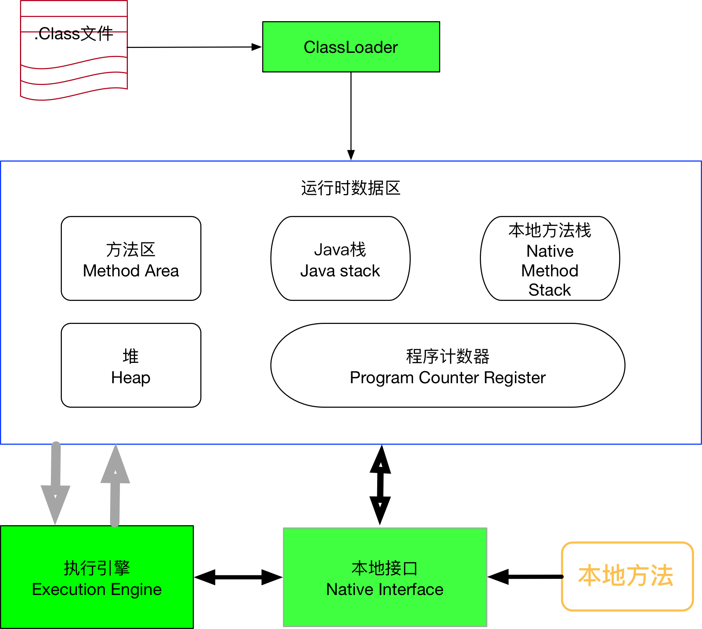

# JVM内存结构

JVM运行时内存区域主要分为: 程序计数器，jvm栈，本地方法栈，堆，方法区

共享内存区域: 方法区和堆内存是所有的线程共享的

线程隔离内存区域:  Java栈、本地方法栈、程序计数器

 

## 方法区

>  方法区中主要存储了以下信息:

* 类的各种加载信息
* 常量
* 静态变量

方法区会被垃圾回收，但是条件比较苛刻，几乎不会被回收.

### JDK1.6/1.7(永久代)

方法区在jdk1.6、1.7中被称为==永久区PermGen==

jdk1.7的Hotspot中就把存放在永久区的字符串常量池移除，放到本地内存（物理内存）

> 可以 通过参数调节方法区大小

* -XX:PermSize            初始化方法区大小
* -XX:MaxPermSize     方法区最大内存

永久代发生内存溢出报错: ==java.lang.OutOfMemoryError PermGen space==

### jdk1.8(元数据区)

> 可以通过参数条件元数据大小(MetaSpace)

* -XX:MetaspaceSize              初始化元数据大小
* -XX:MaxMetaspaceSize       最大元数据空间大小

元数据区发生内存溢出报错: ==java.lang.OutOfMemoryError Metaspace==

### 运行时常量池

​	运行时常量池(Runtime Constant Pool)是方法区的一部分。Class文件中除了有类的版本、字段、方法、接口等描述信息外，还有一项信息就是常量池(Constant Pool Table)，用于存放编译期生成的各种字面量和符合引用，这部分内容将在类加载后进入方法区的运行时常量池中存放。

​	运行时 常量 池 相对于 Class 文件 常量 池 的 另外 一个 重要 特征 是 具备 动态 性， Java 语言 并不 要求 常量 一定 只有 编译 期 才能 产生， 也就是 并非 预置 入 Class 文件 中 常量 池 的 内容 才能 进入 方法 区 运行时 常量 池， 运行 期间 也可 能将 新的 常量 放入 池 中， 这种 特性 被 开发 人员 利用 得比得比 较多 的 便是 String 类 的 intern() 方法。 既然 运行时 常量 池 是 方法 区 的 一部分， 自然 受到 方法 区 内存 的 限制， 当 常量 池 无法 再 申请 到 内存 时会 抛出 OutOfMemoryError 异常。

\

## 堆内存区域

​	对于大多数应用来说，Java堆(Java Heap)是java虚拟机所管理的内存中最大的一块。Java堆是被所有线程共享的一块内存区域，在虚拟机启动时创建。此内存区域的唯一目的就是存放对象实例，几乎所有的对象实例都是在这里分配内存。这一点在Java虚拟机规范中的描述是: 所有的对象实例以及数组都要在堆上分配。

​	Java堆是垃圾收集器管理的主要区域，因此很多时候也被称为"GC堆"。

	>Java堆中还可以细分为:

* 新生代

  > Eden空间

  > From Survivor空间

  > ToSurivivor空间

* 老年代;有Eden空间

Java堆内存区域划分的目的是为了更好地回收内存，或者更快地分配内存。

